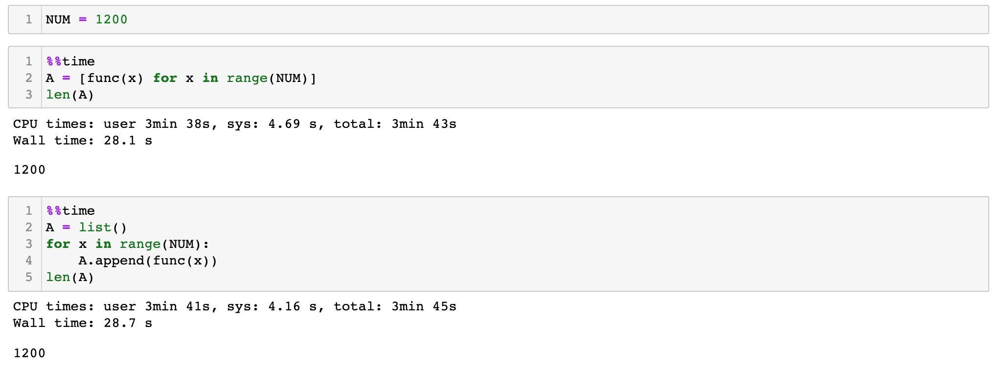
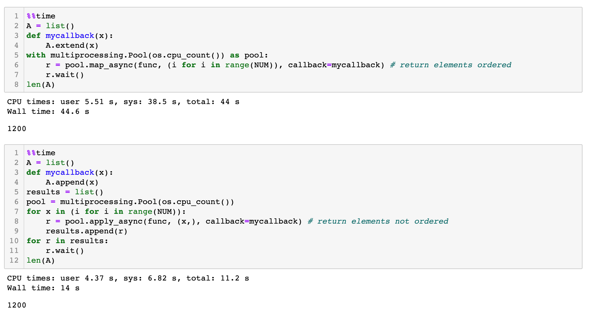

### CIK to PERMNO Mapping
The linking table from wrds/crsp contains the mapping from cik to all historical permno, denoted as `LPERMNO`. e.g. Macy's (cik=794367, LPERMNO=[77462, 18550]). Simply setting `cik` as index and returns `LPERMNO` column as a dictionary would only return one of the `LPERMNO`:
``` python
in[1]: link[(link['cik']==794367)][['cik', 'LPERMNO']].set_index('cik')['LPERMNO'].to_dict()
out[1]: {794367: 18550}
```
The other possibility is to use permco, the unique company identifier. However, if using `permco` to identify the stock performance of a company, it might run into problems when a company has more than one class of shares. e.g. Alphabet (permco=45483, permno=[90319, 14542]). Retriving historical price using permco:
``` python
db.raw_sql(f"SELECT date, prc, cfacpr FROM crsp.dsf WHERE permco=45483")
```
only gives price history from 2014 to 2019:
``` python
        date	        prc	        cfacpr
0	2014-04-03	569.739990	1.002746
1	2014-04-04	543.140015	1.002746
2	2014-04-07	538.150024	1.002746
3	2014-04-08	554.900024	1.002746
4	2014-04-09	564.140015	1.002746
...	...	...	...
5311	2019-12-24	1344.430054	1.000000
5312	2019-12-26	1362.469971	1.000000
5313	2019-12-27	1354.640015	1.000000
5314	2019-12-30	1339.709961	1.000000
5315	2019-12-31	1339.390015	1.000000
```
Using one of the `permno` (90319) would give the full price history from 2014 but not the other one. From a handful of cases, we noticed that the permno that was placed in the first position of a list of permno with the same permco gave the most complete price history. We weren't able to find any official documentation that confirmed this observation. Therefore, just to be safe, we wrote additional logic that would send price history query to wrds/crsp with each permno and use the one that covers just enough of the period that we want to backtest on. 

### Use Multi-Processing to Speed up Backtesting




#### multiprocessing requires the fork to happen in a __main__ protected block


