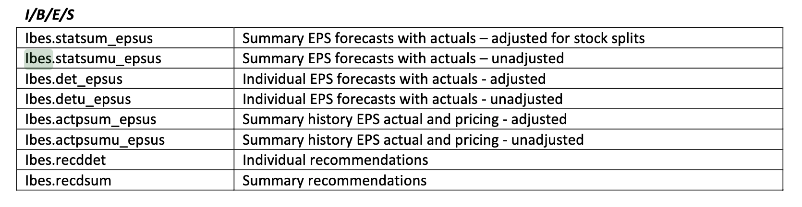

# Variables in Performance Evaluation DataFrame

## EA - Earnings Announcement

# Fetching Price History from Yahoo Finance

## From wrds/crsp
- available through the end of 2019, due to limited access.

## From Yahoo Finance (for price history beyond 2019)

### Incomplete Price History
- `NWE`'s price history starts from 2020-04-04 from Yahoo Finance via url request (consistent with that on finance.yahoo.com), though it's available for much longer periods prior to that from google finance. It transferred its listing from NYSE to Nasdaq on Sep. 30 2020 but not clear how this might caused the lack of price history. Url calls to access price history on google finance are denied and there's no option to download it manually from the site.

# Fetching Data on Earnings Call Annoucement

## From wrds/ibes
list of common datasets from I/B/E/S:

### I/B/E/S data on earnings annoucement is not complete

- Arch Coal, Inc. (CIK: 1037676)'s earnings call on 2012-07-27 is not recorded. Excess total return is 0.354349	with event day volume 1.143154 times higher than the average. [link](https://www.sec.gov/Archives/edgar/data/1037676/000110465912051636/a12-17115_18k.htm)

### Nor does it record Merger&Acquisition annoucement

- Spark Therapeutics, Inc. (CIK: 1609351) annouced a merger on 2019-02-25. Price jumped up to 2.200349 in total returns relative to the market's 0.999898. Volume is 14.623877 times higher than than average. [link](https://www.sec.gov/Archives/edgar/data/1609351/000119312519048943/d711494d8k.htm)

# Fetching Industry Portfolio Data from Ken French

## Incomplete SIC mapping to industry portfolio

- Possible data corruption from wrds's CIK to SIC mapping. e.g. [6797](https://siccode.com/sic-code/679/investing) is not a real subcategory and is not mapped to any of the industry portfolios by the portfolio definition from French.