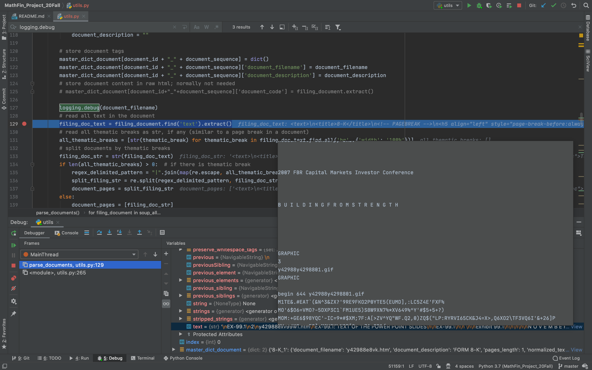

## Data Structure for Saving Scraped Information


```
└── master_dict_xml
    └── accession_num
        ├── category
            ├── label
            ├── scheme
            └── term
        ├── file_info
            ├── act
            ├── file_number
            ├── file_number_href
            ├── filing_date
            ├── filing_href
            ├── filing_type
            ├── form_name
            ├── file_size
            └── xbrl_href
        ├── request_info
            ├── link
            ├── title
            └── last_update
        └── master_dict_filing
            ├── sec_header_content
                ├── sec_header_code
                └── sec_header_text
            └── filing_documents
                └── "Filing_type"_"Filing_sequence"
                    ├── document_filename
                    ├── document_description
                    ├── pages_length
                    └── normalized_text
                        └── page_number
```

Listed are the key name of the dictionary for saving all parsed documents in every filing on a given filing type, for a giving company (CIK) before a given date.

Note: 

1. "quoted key": some value corresponding to "quoted key" takes place
2. unquoted key:  literal name of key
3. $()$: can be added but by default not

## Common Errors from Scraping (with on-going update)

**AttributeError**: when we call `find()` on a document (BeautifulSoup object) to retrieve content of a tag that it does not have, NoneType is returned. Any method call on a NoneType results in AttributeError. Reasons for not having tags that we search for may include 

 1. typo in tag names from SEC Edgar, e.g. \<file_nomber> instead of \<file_number>
 2. missing tags, e.g. no \<document_description> 

 When AttributeError is thrown, we can wrap it in a try-except block and store empty string instead as a place holder. We have to find a balance between how many tags we want to read and store vs. the overall availability of such tags (low availability would result in many try-except blocks). There are more missing tags when parsing documents than parsing filing search results.
 
 Considering 700 companies above the market capitalization threshold of five hundred million in a 20 year time period, we end up with fewer than a dozen of them throwing an AttributeError due to missing tags when parsing documents. This results in us having to wrap almost every variable we want to parse and store for a document with a try-except just for 1% of the cases. For documents that miss what we need to create a unique identifier in a filing (that is, file name and file sequence), we skip that document (there is one such case out of 700 with accession number: 0000950134-02-007532). 
 
**MaximumRecursionError**: we locate each document in a filing via \<document> tag. This will include all documents listed under the same filing, even ones that end with ".pdf" or ".jpg". Trying to convert to string a BeautifulSoup Tag object with the content of a pdf or jpg/gif file will cause recursion error. Examples are
 1. [LPL Financial Holding's 8-K filing that contains pdf and jpg documents](https://www.sec.gov/Archives/edgar/data/1397911/000139791114000131/0001397911-14-000131-index.htm)

 We notice that MaximumRecursionError may also be thrown when processing ".htm" files (e.g. [y42988exv99w1.htm](https://www.sec.gov/Archives/edgar/data/921847/000095012307016001/0000950123-07-016001-index.htm)), though the occurance is rare (happens to less than 1% CIKs - 921847, 1604028, 1034670, 784977, 916457, 1469433). The error occurs at line 3 of the following code snippet:
``` python
1. for filing_document in soup.find_all('document'):
2.     filing_doc_text = filing_document.find('text').extract()
3.     filing_doc_str = str(filing_doc_text)
```
Using the debugger in Pycharm, we see that `filing_doc_text` contains content of subsequent ".gif" files from the web page:

This explains why attemping to convert `filing_doc_text` to string would cause RecursionError. However, it's not clear why `soup.find_all('document)` would push content of multiple document tags into a single tag. For the absolute majority of cases, each item in `soup.find_all('document)` corresponds to a single document tag, where `soup` is a BeautifulSoup object that reads a filing page in html which contains multiple documents, identified by \<document> tag. 

A quick fix is to wrap a try-except block to catch RecursionError and skip current document, which is predominantly a "EX" or supporting document. However, it takes time for the program to reach maximum stack and throw RecursionError, and we would be losing the content of a document that may contain material information. 

## Notes on Reading Scraped JSON files

### pushing all document texts into a single string for textual analysis
As the structure of the json file stores text on each page in a document as a separate dictionary entry with key value being the page number, to dump all page texts into a single file by calling dict.values() would create a list of strings, with each item being the text of a page. As a filing is consisted of several documents, we can use the following list comprehension to read the entire texts of a filing as a list of list `documents_text`, with `documents_text[i][j]` being the texts on the $j$-th page of the $i$-th document for the filing.
``` python
documents_text = [list(document_dict[document]['normalized_text'].values()) for document in document_dict]
```
Then, we might wanna do 
``` python
" ".join(np.array(documents_text).flatten())
```
to flatten the list and join each item by `" "` to obtain a single string that contains all the texts of a filing. However, this would not work if not all document has the same number of pages, since **trying to flatten a nested 2D array with flatten(), where array items are lists with different length, would not actually flatten the array**. As an example, notice
``` python
In [1]: a = np.array([[1, 2], [3, 4, 5]], dtype=object)

In [2]: a.shape
Out[2]: (2,)

In [3]: a.flatten()
Out[3]: np.array([[1, 2], [3, 4, 5]], dtype=object)
```
In this case, the array was considered 1D, and therefore already flattened. It seems unlikely to find a fix within numpy, as of writing. There are a few other fixes, which are listed below, along with their time performance.
``` python
%timeit [document_string for filing_string in documents_text for document_string in filing_string]
%timeit list(itertools.chain(*documents_text))
%timeit sum(documents_text, [])

939 ns ± 16 ns per loop (mean ± std. dev. of 7 runs, 1000000 loops each)
582 ns ± 11.6 ns per loop (mean ± std. dev. of 7 runs, 1000000 loops each)
383 ns ± 7.8 ns per loop (mean ± std. dev. of 7 runs, 1000000 loops each)
```
Though `sum()` seems to give the best performance in this case, it is worth noting that `itertools.chain()` is the preferred method when concatenating a series of iterables, as argued in the [Python 3 documentation](https://docs.python.org/3/library/functions.html#sum). 
